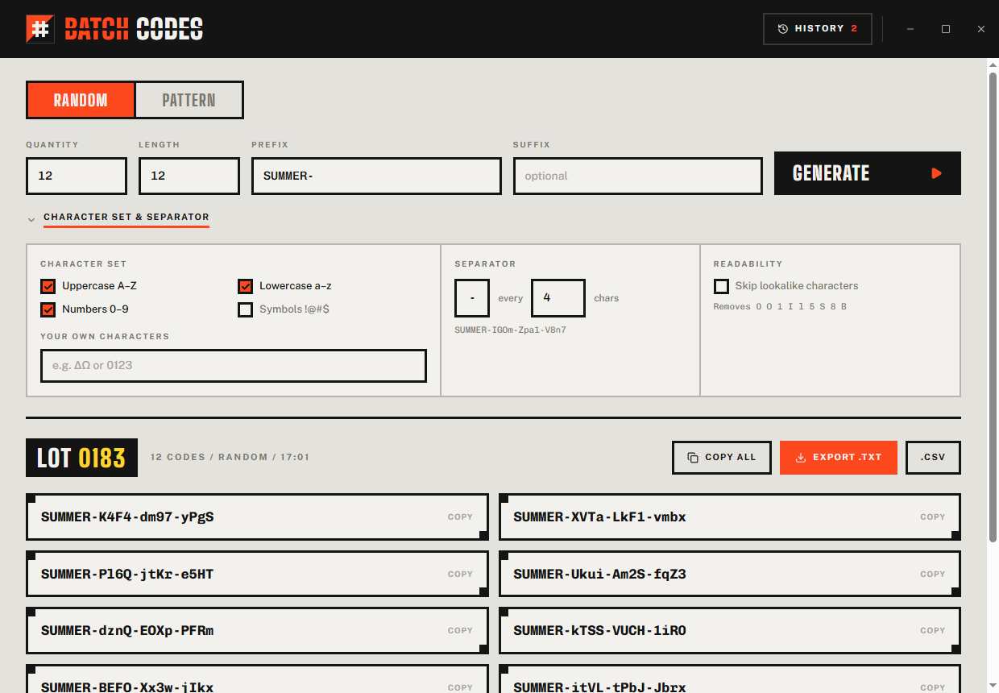
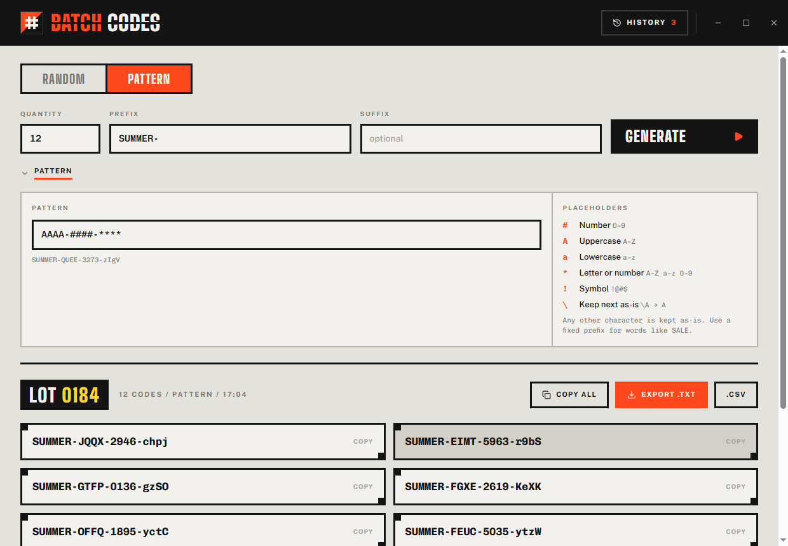
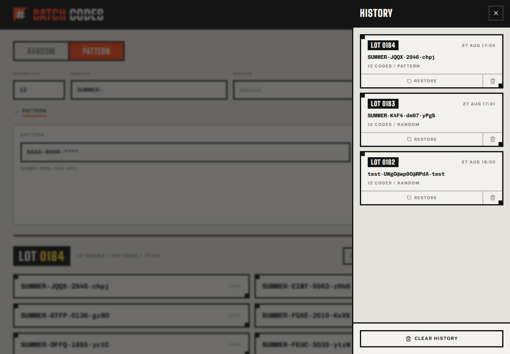

<p align="center">
  
</p>

<h1 align="center">Batch Codes</h1>

Batch Codes generates coupon codes, serial numbers, and license keys in bulk, as a desktop app or in the browser. Pick a character set or write a template pattern, set a quantity, and get a batch of guaranteed unique codes instantly. No account, no server, nothing leaves your machine.

[](#-leave-a-tip)



## Download

**[Download the latest Windows installer →](https://github.com/UMA1R-01/Batch-Codes/releases/latest)**

Grab `Batch.Codes_x.y.z_x64-setup.exe` from the release assets and run it (GitHub replaces the spaces in the filename with dots). It installs to `%LOCALAPPDATA%\Programs\Batch Codes` with a Start Menu shortcut, and registers an uninstaller under Windows' Add/Remove Programs. It relies on the WebView2 runtime, which already ships with Windows 10 and 11. An MSI package is also included in the release assets for environments that prefer it.

The installer is unsigned, so Windows SmartScreen will warn on first run. Choose **More info**, then **Run anyway**.

Prefer to build it yourself instead? See [Building from source](#building-from-source).

## Why

Generating a batch of promo codes or license keys by hand, or with a spreadsheet formula, is slow and error prone. A `RANDBETWEEN` formula does not guarantee uniqueness, and `Math.random()` is not safe for anything redeemable, since its output is predictable from a handful of samples. Batch Codes draws from `crypto.getRandomValues`, guarantees every code in a batch is distinct, and does it all locally in well under a second.

## Features

- **Two generation modes.** Random draws from a character set you choose. Pattern fills a template like `####-AAAA-####` with placeholders for numbers, letters, and symbols.
- **Guaranteed unique.** Every code in a batch is distinct, checked one of two ways depending on how full the output space is: shuffled enumeration when it fits in memory, rejection sampling otherwise. Settings that cannot produce enough unique codes are rejected up front, with the actual number available shown.
- **Full character control.** Uppercase, lowercase, numbers, symbols, and your own custom characters, plus an option to strip lookalike glyphs (`0 O 1 I l 5 S 8 B`) so codes stay readable when read aloud or typed by hand.
- **Prefix, suffix, and separators.** Fixed text on either end, and an automatic separator inserted every N characters.
- **Pattern escaping.** A backslash keeps the next character literal, so a fixed word like `SALE` in a pattern is not mistaken for placeholders.
- **Local history.** The last 50 batches are kept as numbered lots, each restorable back into the form or deletable on its own.
- **Export or copy.** Copy one code, copy the whole batch, or export to `.txt` or `.csv`.
- **Runs offline.** No account, no server, and no network calls of any kind. Every setting and every lot lives in local storage on this device only.

### Pattern mode, with a live preview

Six placeholder tokens cover numbers, letters, and symbols, and anything else typed into the pattern is kept as literal text. A live preview under the field shows exactly what the format produces before you generate anything.



### Every batch kept as a numbered lot

Generating a batch stamps it with a sequential lot number and saves it to local history automatically, with no save button to press. Restore brings the exact settings and codes back into the form; delete removes one entry without touching the rest.



## Desktop vs. browser

The same codebase ships both ways. The desktop build adds native window chrome on top:

| | Desktop (Tauri) | Browser |
| --- | --- | --- |
| Window | Frameless. The app's own masthead doubles as the title bar: drag, minimize, maximize, close | Normal browser tab |
| Icon | The app's own icon, in the taskbar and the title bar | Browser tab favicon |
| Storage | Local storage inside the app's own WebView profile | Local storage inside the browser |

The frontend detects which environment it is running in at startup, so the same build works either way with no separate browser bundle.

## Tech stack

- **[React 19](https://react.dev)** and **[TypeScript](https://www.typescriptlang.org)**
- **[Vite](https://vite.dev)** for the dev server and bundling
- **[Tailwind CSS v4](https://tailwindcss.com)**, configured CSS first, with no separate config file
- **[Radix UI](https://www.radix-ui.com)** primitives (dialog, tabs, switch, label, tooltip), styled to the app's own design system
- **[lucide-react](https://lucide.dev)** for icons
- **[sonner](https://sonner.emilkowal.ski)** for toast notifications
- **[Tauri v2](https://tauri.app)** (Rust) for the desktop shell
- **[class-variance-authority](https://cva.style)** and **[tailwind-merge](https://github.com/dcastil/tailwind-merge)** for the component variants

## Building from source

### Prerequisites

For the web build you only need [Node.js](https://nodejs.org) 20.19+ or 22.12+.

The desktop build additionally needs the [Tauri v2 prerequisites](https://tauri.app/start/prerequisites/) for your platform. On Windows that means:

- [Rust](https://rustup.rs), stable channel, MSVC toolchain
- Microsoft C++ Build Tools, including the Windows SDK
- The WebView2 runtime, which already ships with Windows 10 and 11

### Install

```bash
git clone https://github.com/UMA1R-01/Batch-Codes.git
cd Batch-Codes
npm install
```

### Run

```bash
npm run dev
```

```bash
npm run tauri:dev
```

`npm run dev` serves the web app at `http://localhost:5173`. `npm run tauri:dev` launches the desktop window and starts Vite for you. The first desktop run compiles the whole Rust dependency tree and can take several minutes, later runs take seconds.

### Build

```bash
npm run build
```

```bash
npm run tauri:build
```

`npm run build` type checks the project with `tsc` and bundles it to `dist/`. `npm run tauri:build` produces a Windows installer under `src-tauri/target/release/bundle/`. `npm run typecheck` runs the type checker on its own, with no bundling.

## Project structure

```
src/
  core/           Pure logic, no React or DOM imports
    random.ts       CSPRNG with rejection sampling
    charset.ts      Character pools, pattern tokens
    codegen.ts       Slot compiler, uniqueness, capacity
    validate.ts      Bounds and capacity checks
    export.ts        .txt / .csv writers
  hooks/          History and persisted settings state
  lib/
    storage.ts       The only module that touches local storage
    utils.ts         cn(), ids, date formatting
  components/
    ui/              Shared primitives on Radix UI
  types/
src-tauri/
  src/              Window setup
  capabilities/     Permission grants for the desktop shell
  icons/            App icon, generated for every platform size
```

## How a few things work

**Uniqueness.** Every code is modeled as a list of slots, each either a fixed literal or a pool to draw one character from, and Random and Pattern mode both compile down to the same representation. When the output space is small enough to fit in memory, Batch Codes shuffles the whole index space with a partial Fisher-Yates and decodes it directly, so codes cannot collide at all. Otherwise it draws randomly and rejects collisions, which stays fast as long as the space is not close to full. Either way, requesting more unique codes than the settings can produce fails immediately with the real number available, instead of quietly returning duplicates.

**Randomness.** Codes are drawn from `crypto.getRandomValues`, pooled and consumed with rejection sampling to avoid modulo bias. `Math.random()` is never used, since its output is predictable from a handful of observed values, which makes it unsafe for anything redeemable.

**Pattern escaping.** A pattern is walked character by character. Six tokens (`# A a * !` plus the escape character) map to a pool of characters, and everything else is kept literal. A backslash before a token character, like `\A`, inserts that character literally instead of treating it as a placeholder.

**The custom title bar.** With native window decorations turned off, the app's own masthead becomes the title bar. A `data-tauri-drag-region` attribute makes the empty parts of the bar draggable, and the minimize, maximize, and close buttons call the Tauri window API directly. The whole bar, controls included, is skipped entirely when the same build runs in a browser instead of the desktop shell.

## ☕ Leave a tip

💛 If you like this app, a tip is always welcome!

<div>


```
bc1qs25pegh3232q9j58kt5dgczymcj4pg8a5un2zp
```

</div>

<div>


```
0x81F29C9Dca41cb57395BE5b56c7606653A8c2E34
```

</div>

<div>


```
G57VrGCbAFWSe2vPfx2ZrUUxzJeiARncKUkYMxw3wKVa
```

</div>

## License

[MIT](LICENSE) © Umair Aamir
